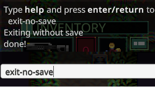

# Quasimorph Exit Without Save Command

* Adds a `save` command to save at any time.
* Adds an `exit-no-save` to exit the current game without saving.

This allows developers to test the same scenario without restarting the game.
For example, killing monsters, spawning items in space, etc.

# Usage
Open the game console with the backtick key, and then type one of the commands and enter.

# Support
If you enjoy my mods and want to buy me a coffee, check out my [Ko-Fi](https://ko-fi.com/nbkredspy71915) page.
Thanks!

# Source Code
Source code is available on GitHub at https://github.com/NBKRedSpy/QM_ExitWithoutSaveCommand

# Change Log
# 1.3.0
* Added save command.
