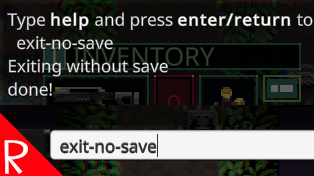

# Quasimorph Exit Without Save Command

# Important - This is only for the opt in beta version of the game!

This is a temporary version that supports the 0.8.6 beta, and not the current game's version.
The non beta version *must* be uninstalled.  
When the 0.8.6 becomes the main version, this mod will be deleted.
Note that the beta is expected to change many times before release.
As such, this mod may break on each beta release.

# Docs

A console command to exit a dungeon (combat) without saving. 

This allows developers to test the same scenario without restarting the game.

For example, killing monsters or taking damage.

# Usage
Install the Quasimorph developer console mod.

When in the dungeon mode (combat), open the console and type exit-no-save and press enter.

The game will now exit back to the main menu without changing the save.

# Support
If you enjoy my mods and want to buy me a coffee, check out my [Ko-Fi](https://ko-fi.com/nbkredspy71915) page.
Thanks!

# Source Code
Source code is available on GitHub at https://github.com/NBKRedSpy/QM_ExitWithoutSaveCommand
